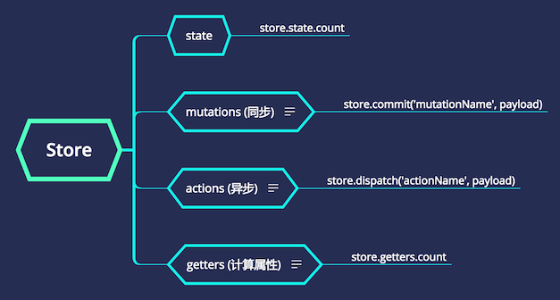

跨组件通讯，应用内通讯可以使用 store (也就是 vuex)。需要注意 store 是内存数据，刷新页面后就没了，持久化的数据就需要使用 HTML5 的 LocalStorage，而不能使用 vuex。

一般会在 store.js 中全局注册 Store，然后页面中的所有组件都能使用 store 了。

Store 涉及到的关键内容有 4 个:



* State: 所有的状态都要存储到 state 对象中
* Mutations: 修改 state 中的数据不要直接修改变量，而是应该通过 mutation，只能进行同步操作
* Actions: 也是用来修改 state 中的变量，进行异步操作，例如使用 Ajax 请求数据后保存到 state，mutation 只能用于同步操作
* Getters: 很像 computed 函数，定义一些方法方便的访问 state 中的数据，可以是多个数据的计算结果

使用 store 一般可分为以下几步:

1. 定义 state: 在 store.js 中
2. 定义 mutations: 在 store.js 中
3. 读取 state: 可以直接通过变量访问，也可以使用 getter
4. 修改 state: 
   * 通过 store.commit() 调用 mutation 来修改 state，不要直接通过变量赋值
   * 通过 store.dispatch() 调用 action 来修改 state，不要直接通过变量赋值，action 中也可以调用 mutation 进行修改

下面以访问变量 selectedRegion 为例进行介绍。

## 定义 state

自定义的变量 (状态) 都必须定义在 state 下面:

```js
export default new Vuex.Store({
    // 定义状态
    state: {
        selectedRegion: {
            provinceId: 0,
            cityId    : 0,
            districtId: 0
        }
    }
});
```

## 定义 mutation

```js
export default new Vuex.Store({
    // 定义状态
    state: {
        selectedRegion: {
            provinceId: 0,
            cityId    : 0,
            districtId: 0
        }
    },
    // 修改状态
    mutations: {
        selectRegion(state, region) {
            state.selectedRegion.provinceId = region.provinceId;
            state.selectedRegion.cityId     = region.cityId;
            state.selectedRegion.districtId = region.districtId;
        }
    }
});
```

Mutation 的函数`最多有 2 个参数`: 第一个参数必须是 state，第二个参数可以是简单类型如 int，也可以是复杂类型如 JSON 对象，通过 mutation 来修改 state，千万不要直接给 state 下的变量赋值，因为直接赋值的话值虽然变了，但不是响应式的，使用这个变量的地方 Ui 不会自动更新，这就是 mutation 存在的价值。

## 读取 state

在页面中直接使用变量访问读取 state: `this.$store.state.selectedRegion.provinceId`

```html
<template>
    {{ this.$store.state.selectedRegion.provinceId }}
</template>
```

## 使用 getter

需要计算的状态使用 getter (相当于 vue 的 computed 函数)，getter 接受 state 作为其第一个参数，也可以接受其他 getter 作为第二个参数:

```js
export default new Vuex.Store({
    // 定义状态
    state: {
        selectedRegion: {
            provinceId: 0,
            cityId    : 0,
            districtId: 0
        }
    },
    // Getter 访问状态
    getters: {
        region: state => {
            return `ProvinceId: ${state.selectedRegion.provinceId}, CityId: ${state.selectedRegion.cityId}`;
        }
    }
});
```

调用 `this.$store.getters.region` 访问:

```html
<template>
    {{ this.$store.getters.region }}
</template>
```

## 修改 state

调用 `commit()` 函数提交修改，第一个参数是 mutation 的函数名:

```js
this.$store.commit('selectRegion', {
    selectedProvinceId: this.selectedProvinceId,
    selectedCityId    : this.selectedCityId,
    selectedCountyId: this.selectedCountyId}
);
```

## 参考文档

官方为 vuex 提供了非常完善的帮助文档，更详细的细节请阅读 <https://vuex.vuejs.org/zh-cn>。