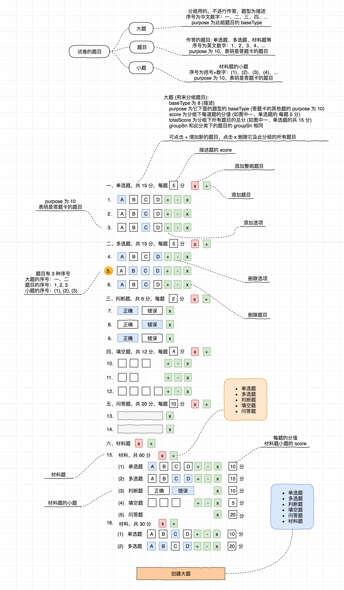

答题卡也是一份试卷，只不过排版比较特殊

* 创建大题的时创建一个描述，所谓的大题就是用来分组题目的:
  * purpose 为所属题目的类型，例如单选题、多选题
  * groupSn 为此组题目的序号
  * score 为此组题目下每题的得分
  * 点击删除按钮删除本组所有题
  * 点击添加是添加 purpose 指定的题目
* 除了描述，其他题型的 purpose 皆为 10，表示用于答题卡，目的是抽题时 purpose 不为 0 的题目不参与抽题
* 单选题、多选题、填空题都能够添加、删除选项 (空)
* 添加材料题的小题时通过弹出菜单选择题型
* 材料题的小题保存它的分值
* 每个题目后面都有一个删除按钮，用于删除题目自己
* 每个题目都有一个字段 snLabel 用来存储它的序号，这个序号是后台通过算法计算出来的，没有存储在题干里

设计图:

