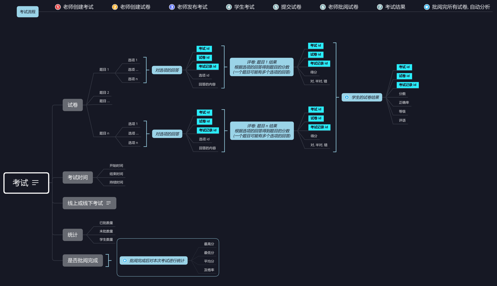

考试设计的主要关系图如下:



解析:

* 考试
  * 配置考试使用的试卷
  * 考试时间范围有 3 个参数: 开始时间, 结束时间, 持续时间. 可以考试的时间为考试时间范围与持续时间的交集, 例如考试时间为 2019-01-01 00:00 到 2019-01-04 00:00 之间, 最多作答 60 分钟, 当 2019-01-01 14:00 到 2019-01-01 15:00 作答了 60 分钟, 使用完了考试时间, 考试结束, 不能够继续作答了, 如果学生没有提交考试, 系统必须进行自动提交
  * 批卷统计: 未批数量, 已批数量
  * 考试统计: 最高分, 最低分, 平均分, 及格率等
  * 创建答题卡的考试时, 先创建考试和一份空的试卷, 试卷的题目会在后续操作中创建
  * 发布试卷时为每个学生创建一条考试记录 (考试记录存储了针对某次考试, 第 N 次试卷的回答结果, 例如得分, 作答试卷, 排名, 考试状态等等)
* 发布考试: 考试的创建老师不一定一次就做完了, 所以在编辑过程中的考试学生不应该看到, 而是等老师编辑好后点击发布考试按钮后学生才能看到
* 查询考试: 
  * 老师: 查询老师创建的考试
  * 学生: 查询所在班级各学科下发布过的考试

* 作答: 能够进行作答的题目都是对题目的选项进行回答
* 考试记录: 一次考试虽然只有一份试卷, 但是设计上允许重做试卷, 例如练习用的试卷, 所以针对试卷的每次作答使用考试记录来保存
* 提交试卷: 试卷只有提交后老师才能进行批改
* 考试结果: 老师批改后得到考试结果
* 自动分析: 全班的考试都批改完成后后台对本次考试进行分析, 得到最高分, 最低分, 平均分, 及格率等

## 数据流

1. 老师创建考试 (答题卡): 

   1. 创建考试 (表 exam): 

      ```java
      ExamService.createOrUpdateExam(userId, exam)
      ```

   2. 同时创建一份空的试卷 (表 exam_paper), 试卷中此时没有任何题目: 

      ```java
      ExamMapper.insertOrUpdatePaper(paper)
      ```

2. 老师创建试卷: 创建题目 (表 exam_question) 和题目的选项 (表 exam_question_option), 把题目和试卷关联起来 (表 exam_paper_question):

   ```java
   ExamQuestionService.createOrUpdateQuestion()
   ExamService.createOrUpdatePaper()
   ExamMapper.insertOrUpdatePaperQuestion()
   ```

3. 老师创建的考试: 列出老师在某个班级下创建的考试: 

   ```java
   ExamMapper.findExamsByTeacherIdAndClazzId(teacherId, clazzId)
   ```

4. 发布考试: 修改表 exam 的字段 `published` 为 1, (1 表示发已布, 0 表示未发布), 并且为班级的学生各创建一个考试记录:

   ```java
   ExamService.publishExam(examId, clazzIds)
   ```

5. 学生考试: 

   1. 考试列表: 实际上是显示发布考试时给学生创建的考试记录:

      ```java
      ExamService.findStudentRecordsByClazzIdAndSubject(clazzId, subject, studentId, offset, pageSize)
      ```

   2. 考试记录: 点击开始考试或者继续考试按钮, 获取对应考试记录的详情: 包括考试和试卷 (问题作答的记录和得分,):

      ```java
      ExamService.findRecordByIdForStudent(recordId, detail)
      ```

   3. 考试作答: 对题目的回答是对题目的选项进行作答, 而不是题目本身 (表 exam_question_reply):

      ```java
      ExamService.createOrUpdateQuestionReply(recordId, replies)
      ```

   4. 提交试卷: 对主观题进行自动批改，并保存每一道题的问题结果 (表 exam_question_result 和 exam_record):

      ```java
      ExamService.submitPaper(recordId)
      ```

6. 老师批阅试卷: 

   1. 针对每一道主观题进行批阅, 其实就是打个分就完事了 (表 exam_question_result):

      ```java
      ExamMapper.insertOrUpdateQuestionResult(questionResult)
      ```

   2. 考试结果: 老师点击批改完成按钮, 计算学生的考试结果:

      ```java
      ExamService.createOrUpdatePaperResult(recordId)
      ```

   3. 当老师点击批改完成按钮时, 服务器端发现所有学生的考试都批改完成了, 就会自动分析统计考试结果 (表 exam)