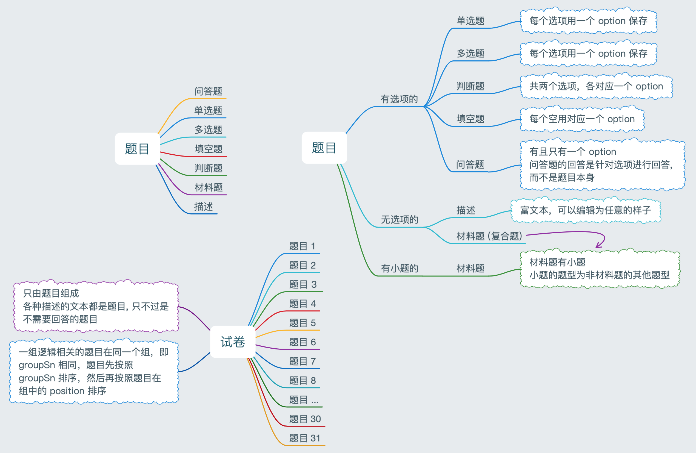
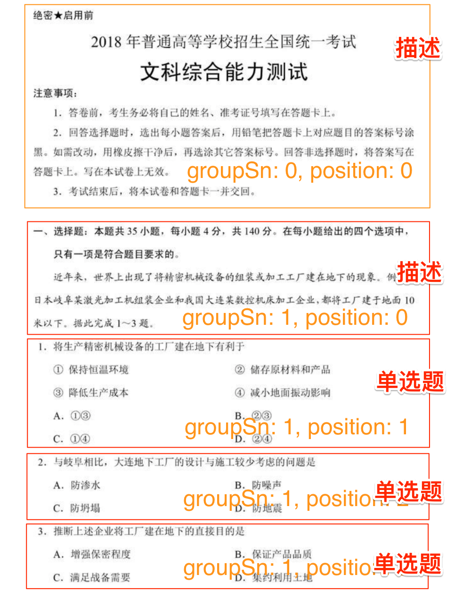
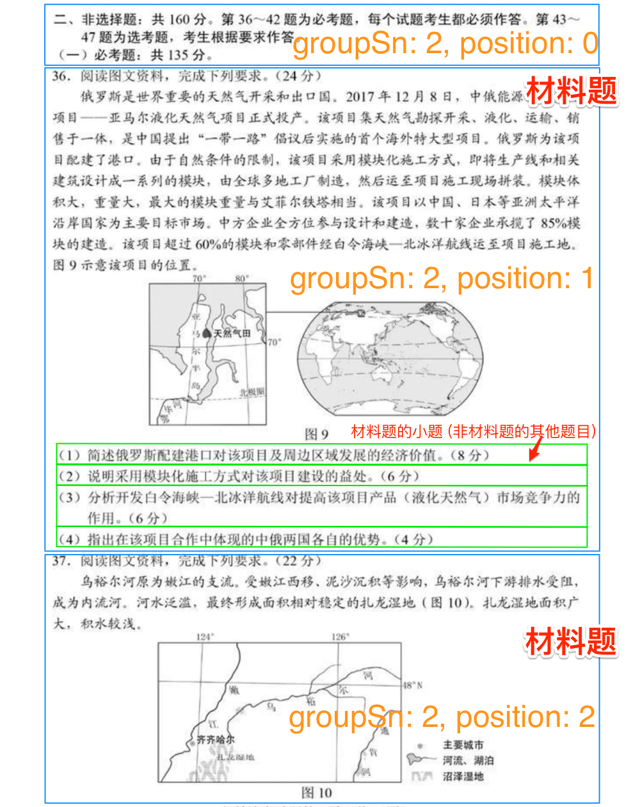

## 题目分类、试卷和题目的关系

下面从不同的维度对试卷的题目进行描述:



说明: 试卷上不只是有题目，还有一些描述性的信息，例如试卷的标题，选择题的说明等。`描述`按道理说不应该是一种题型，但是为了简化试卷的设计 (只由题目组成)，所以把描述也作为一种题型出现。描述的题目比较特殊，没有选项，也不需要回答，只是一段富文本，用于信息展示，可编辑为任意的样式，这样就能让试卷设计成各种样子。

分组: 题目有一个属性 groupSn，用来把逻辑相同的题目放在一组，其实也可以把所有题目的 groupSn 设置为 0，把他们放在同一组里，只要设置对他们的 position 就可以了。

选项: 所有需要回答的题目都是针对选项进行回答, 这样就能够使用统一的方式对作答进行存储, 获取, 进行数据分析, 简化逻辑:

* 选择题: 选项是选择题的天然属性
* 判断题: 判断题就是只有 2 个选项的单选题, 对与错
* 填空题: 有可能有多个空, 每个空作为一个选项保存, 对选项进行回答, 就能很容易的区分是对题目中的哪一个空进行的回答. 至于展示的时候，可以根据不同的实现展示为不同的样子，MVC 而已
* 问答题: 最直观的设计就是对问答题直接进行回答, 但是这就需要单独对问答题的回答进行设计, 会增加开发的复杂度和难度, 为了统一, 对问答题进行了特殊的处理, 增加一个选项, 对选项进行回答即可

## 试卷设计

试卷由题目组成，逻辑相同的题目例如单选题放在同一个组中，即 groupSn 相同。题目在试卷上的顺序规则为:

1. 先按照 groupSn 排序
2. 如果 groupSn 相同再按照 position 排序 
3. 材料题的小题在放在材料题后面，小题顺序按照小题的 position 排序 
4. 选项的顺序按照选项的 position 排序

其实接口返回试卷的题目数组中已经对所有题目、小题、选项排好序了，按顺序遍历数组即可。

下面对一张试卷标记题目之间的关系:





## 数据库设计

考试主要涉及到 8 张表：


| 名字       | 表名                       | 描述                                                         |
| ---------- | -------------------------- | ------------------------------------------------------------ |
| 题目       | exam_question              | 由选项组成                                                   |
| 题目的选项 | exam_question_option       | 题目的选项，每个题目默认都有个位置属性，非打乱选项顺序时用   |
| 试卷的题目 | exam_paper_question        | 题目在某个试卷里的位置、分值、分组 (例如属于单选题) 等       |
| 试卷       | exam_paper                 | 只有一个核心字段 ID 表示考试的 ID，在 exam_paper_question 中使用 |
| 考试       | exam                       | 考试设置，包含试卷、以及考试相关的信息组成，<br>例如考试时间、是否允许查看答案、是否打乱题目顺序、是否打乱选项顺序 |
| 考试记录   | exam_record                | 保存学生考试的记录，包含有 exam_id，考试的次数，用户 ID 等   |
| 题目作答表 | exam_questioin_reply       | 学生对题目的作答，包含试卷 ID、作业 ID、题目 ID 等、<br>客观题选项的 ID (不是 ABCD)、主观题的文字内容 |
| 错题表     | exam_questioin_reply_error | 错题表，记录用户回答错误的题目                               |

## 题目

> 提示：所有需要直接作答的题目都有选项，是为了作答使用选项保存，统一格式，简化开发，所以单选题、多选题、判断题、问答题、填空题和作业题都是有选项的，只是选项的个数不同。
>
> 题目 Question 的属性有 2 个用途:
>
> * 普通题目：使用和试卷无关的属性，用于表 exam_question
> * 试卷题目：使用和试卷有关的属性，用于表 exam_paper_question

题目分类:

* 客观题有 `单选题`、`多选题`、`判断题`: 一个题目有多个选项，有一个或者多个选项是正确答案

* 主观题有 `问答题`、`填空题`、`作业题`

  * 问答题: 有一个选项 (逻辑上是没有选项的，但是为了统一保存作答内容，简化接口开发，所以每个问答题都有一个固定的选项)
  * 填空题: 有多个选项 (每个空就是一个选项)，每个空使用 HTML 的 `<abbr class="fitb">________</abbr>` 表示，也就是说在题干的 HTML 中找到多少个 `<abbr class="fitb">________</abbr>` 就有多少个空
  * 作业题: 有一个选项

* 比较特殊的题有 `材料题`，本身是一个题目，它又有多个子题目，每子小题目是一个普通的题目 (单选题、多选题、判断题、填空题、问答题)，题目表里设计了一个特殊字段 **parent_id** 来解决把所有题目的数据都放到一张表里，题目最多有 2 级:

  * parent_id 等于 0 时表示第一级题目，试卷选题时选择 parent_id 为 0 的题目，保存在 exam_paper_question 表中
  * parent_id 不为 0 时表示第二级题目，为材料题的子题目，parent_id 为材料题的 ID
  * 查询试卷的题目时，先从表 exam_paper_question 得到所有的一级题目 (parent_id 为 0)，然后找到里面 base_type 为材料题的所有题目 ID，然后再去查找它们的所有子题目

* 描述性的题目: 不用于作答，只是为了在试卷上显示一些信息 (因为使用富文本编辑，所以可以编辑出各种效果)，例如:

  > 一、选择题: 本大题共 8 小题，每小题 5 分，共 40 分。在每小题给出的 4 个选项中，只有一项是符合题目要求的。
  >
  > 二、文言文阅读 (共 22 分，其中选择题 12 分，每小题 3 分，翻译题 10 分)。

* `扩展题型` 不是新的题型，只是基本题型的别名，根据用途命名

```sql
#-------------------------------------------
# 表名：exam_question
# 作者：黄彪
# 日期：2018-06-02
# 版本：1.0
# 描述：题目
#------------------------------------------
DROP TABLE IF EXISTS exam_question;

CREATE TABLE `exam_question` (
    `id`          bigint(20) unsigned NOT NULL       COMMENT '题目的 ID',
    `content`     text                               COMMENT '题目的内容',
    `phase`       varchar(128) DEFAULT NULL          COMMENT '阶段: 小学、初中、高中',
    `subject`     varchar(128) DEFAULT NULL          COMMENT '学科: 语文、数学',
    `base_type`   varchar(128) DEFAULT NULL          COMMENT '基本题型: 单选题、多选题、判断题、问答题、填空题、材料题、描述',
    `extend_type` varchar(128) DEFAULT NULL          COMMENT '扩展题型: 实验题、解答题、作图题，只是基本题型的别名',
    `knowledge_point_code` varchar(128) DEFAULT NULL COMMENT '知识点编码',
    `chapter_code`         varchar(128) DEFAULT NULL COMMENT '章节编码',
    `classification`       varchar(128) DEFAULT NULL COMMENT '试题分类: 期中、期末、单元测试、专项练习',
    `teach_demand`         varchar(64)  DEFAULT NULL COMMENT '教学要求: 了解、理解、掌握、运用、综合',
    `difficulty`   int(11) DEFAULT 0                 COMMENT '难度 (最大为 5): 1(容易), 2(较易), 3(一般), 4(较难), 5(困难)',
    `publish_year` int(11)      DEFAULT 0            COMMENT '发布年代',
    `region`       varchar(128) DEFAULT NULL         COMMENT '适用地区',
    `origin`       varchar(128) DEFAULT NULL         COMMENT '试题来源',
    `creator`      varchar(128) DEFAULT NULL         COMMENT '创建者',
    `reviser`      varchar(128) DEFAULT NULL         COMMENT '最后修改人',
    `audit_status` int(11)      DEFAULT 0            COMMENT '审核状态: 0(未处理), 1(通过), 2(未通过)',
    `used_count`   int(11)      DEFAULT 0            COMMENT '使用次数',
    `analysis`     text                              COMMENT '解析',
    `parent_id`    bigint(20) DEFAULT 0              COMMENT '材料题时的材料题的 ID',
    `created_time` datetime   DEFAULT NULL           COMMENT '创建时间',
    `updated_time` timestamp NOT NULL DEFAULT CURRENT_TIMESTAMP ON UPDATE CURRENT_TIMESTAMP COMMENT '更新时间',
    PRIMARY KEY (`id`)
) ENGINE=InnoDB;
```

## 题目的选项

需要注意的估计只有 `position` 这个字段，选项没有保存 ABCD 等固定的顺序，是否正确答案也没有用 ABCD 等表示，而是给选项增加一个 boolean 属性表示正确还是错误，创建题目的时候给定选项一个在题目中的固定顺序，平时就按这个顺序显示选项 (显示给用户为 ABCD)，当试卷要求打乱选项顺序的时候就不按照 position 显示，而是随机打乱选项。

```sql
#-------------------------------------------
# 表名：exam_question_option
# 作者：黄彪
# 日期：2018-06-02
# 版本：1.0
# 描述：题目的选项
#------------------------------------------
DROP TABLE IF EXISTS exam_question_option;

CREATE TABLE `exam_question_option` (
    `id`          bigint(20) unsigned NOT NULL COMMENT '选项的 ID',
    `content`     text                         COMMENT '选项的内容',
    `is_correct`  tinyint(11) DEFAULT 0        COMMENT '是否正确的选项',
    `question_id` bigint(20)  DEFAULT NULL     COMMENT '所属题目的 ID',
    `position`    int(11)     DEFAULT 0        COMMENT '选项在题目中的位置',
    PRIMARY KEY (`id`)
) ENGINE=InnoDB;
```

## 试卷的题目

题目在某个试卷里的位置、分值、分组 (例如属于单选题) 等。分组的作用是把一组题目归为一组进行显示，例如单选题分一组，多选题分一组，阅读理解分一组。试卷中的题目按分组进行排序，同一组中的题目按题目的 position 进行排序。

```sql
#-------------------------------------------
# 表名：exam_paper_question
# 作者：黄彪
# 日期：2018-06-02
# 描述：试卷的题目，包含的信息有如题目在某个试卷里的位置、分值、分组 (例如属于单选题) 等
#      分组的值可以随意，只要同一个组的 group 值相同就行
#------------------------------------------
DROP TABLE IF EXISTS exam_paper_question;

CREATE TABLE `exam_paper_question` (
    `id`           bigint(20) unsigned NOT NULL COMMENT '无意义的主键 ID',
    `paper_id`     bigint(20) DEFAULT 0         COMMENT '试卷的 ID',
    `question_id`  bigint(20) DEFAULT 0         COMMENT '问题的 ID',
    `position`     int(11)    DEFAULT 0         COMMENT '题目在试卷里的位置',
    `score`        double     DEFAULT 0         COMMENT '题目的分值',
    `group`        int(11)    DEFAULT 0         COMMENT '分组，例如属于单选题',
    `created_time` datetime   DEFAULT NULL      COMMENT '创建时间',
    `updated_time` timestamp NOT NULL DEFAULT CURRENT_TIMESTAMP ON UPDATE CURRENT_TIMESTAMP COMMENT '更新时间',
    PRIMARY KEY (`id`)
) ENGINE=InnoDB;
```

## 试卷

```sql
#-------------------------------------------
# 表名：exam_paper
# 作者：黄彪
# 日期：2018-06-02
# 版本：1.0
# 描述：试卷，就只有一个试卷 ID 是关键，在 exam_paper_question 中使用，表示题目属于某个试卷
#------------------------------------------
DROP TABLE IF EXISTS exam_paper;

CREATE TABLE `exam_paper` (
    `id`           bigint(20) unsigned NOT NULL COMMENT '试卷的 ID',
    `user_id`      bigint(20) DEFAULT 0         COMMENT '创建试卷用户的 ID',
    `created_time` datetime   DEFAULT NULL      COMMENT '创建时间',
    `updated_time` timestamp NOT NULL DEFAULT CURRENT_TIMESTAMP ON UPDATE CURRENT_TIMESTAMP COMMENT '更新时间',
    PRIMARY KEY (`id`)
) ENGINE=InnoDB;
```

## 考试

考试，包含试卷、以及考试相关的信息组成，例如考试时间、是否允许查看答案、是否打乱题目顺序、是否打乱选项顺序，考试时间为在 start_time 和 end_time 之间，最多考 duration 分钟，允许考几次等。

考试时间为在 start_time 和 end_time 之间，最多考 duration 分钟。例如考试时间为 120 分钟，开始和结束时间为 `2018-06-01 14:00:00 到 2018-06-05 14:00:00` 之间。小明于 2018-06-03 10:00:00 开始考试，到  2018-06-05 14:00:00 时一共只答了 100 分钟，虽然总共答题时间还有 20 分钟，但是因为考试结束时间到了，小明就不允许再继续答题了，考试已经结束。

```sql
#-------------------------------------------
# 表名：exam
# 作者：黄彪
# 日期：2018-06-02
# 版本：1.0
# 描述：考试，包含试卷、班级、以及考试相关的信息组成，例如考试时间、是否允许查看答案、是否打乱题目顺序、是否打乱选项顺序，
#      考试时间为在 start_time 和 end_time 之间，最多考 duration 分钟，允许考几次等
#------------------------------------------
DROP TABLE IF EXISTS exam;

CREATE TABLE `exam` (
    `id`         bigint(20) unsigned NOT NULL           COMMENT '考试的 ID',
    `paper_id`   bigint(20) DEFAULT 0                   COMMENT '试卷的 ID',
    `clazz_id`   bigint(20) DEFAULT 0                   COMMENT '班级的 ID',
    `start_time` datetime   DEFAULT NULL                COMMENT '考试开始时间',
    `end_time`   datetime   DEFAULT NULL                COMMENT '考试结束时间',
    `duration`   int(11)    DEFAULT 0                   COMMENT '考试持续时间, 单位为分钟, 例如 2 小时',
    `times`      int(11)    DEFAULT 0                   COMMENT '允许考试的次数',
    `is_question_shuffled`        tinyint(4)  DEFAULT 0 COMMENT '是否打乱问题',
    `is_question_option_shuffled` tinyint(11) DEFAULT 0 COMMENT '是否打乱问题的选项',
    `user_id`      bigint(20)     DEFAULT 0             COMMENT '创建考试用户的 ID',
    `created_time` datetime       DEFAULT NULL          COMMENT '创建时间',
    `updated_time` timestamp NOT NULL DEFAULT CURRENT_TIMESTAMP ON UPDATE CURRENT_TIMESTAMP COMMENT '更新时间',
    PRIMARY KEY (`id`)
) ENGINE=InnoDB;
```

## 考试记录

同一个试卷可以考多次，所以需要一个考试记录表记录某个试卷不同的作答，作答记录需要根据考试记录来判断某个题的回答是哪次做的。

```sql
#-------------------------------------------
# 表名：exam_record
# 作者：黄彪
# 日期：2018-06-02
# 版本：1.0
# 描述：考试记录，保存学生考试的记录，同一个试卷可以考多次，考试记录用来确定某一次考试
#------------------------------------------
DROP TABLE IF EXISTS exam_record;

CREATE TABLE `exam_record` (
    `id`           bigint(20) unsigned NOT NULL COMMENT '试卷记录的 ID',
    `user_id`      bigint(20) DEFAULT 0         COMMENT '考试用户的 ID',
    `exam_id`      bigint(20) DEFAULT 0         COMMENT '考试的 ID',
    `paper_id`     bigint(20) DEFAULT 0         COMMENT '试卷的 ID',
    `created_time` datetime   DEFAULT NULL      COMMENT '创建时间',
    `updated_time` timestamp NOT NULL DEFAULT CURRENT_TIMESTAMP ON UPDATE CURRENT_TIMESTAMP COMMENT '更新时间',
    PRIMARY KEY (`id`)
) ENGINE=InnoDB;
```

## 题目作答表

题目作答表，记录用户什么时候、回答什么试卷 (作业) 的题目，回答客观题时记录选项的 ID，主观题记录回答的内容。

* 考试: 记录 paper_id 和 record_id，record_id 为 exam_record 的 ID
* 作业: 记录 record_id 为作业的 ID，paper_id 为 0

```sql
#-------------------------------------------
# 表名：exam_questioin_reply
# 作者：黄彪
# 日期：2018-06-02
# 版本：1.0
# 描述：题目作答表，记录用户什么时候、回答什么试卷 (作业) 的题目，回答客观题时记录选项的 ID，主观题记录回答的内容:
#      考试: 记录 paper_id 和 record_id，record_id 为 exam_record 的 ID
#      作业: 记录 record_id 为作业的 ID，paper_id 为 0
#------------------------------------------
DROP TABLE IF EXISTS exam_questioin_reply;

CREATE TABLE `exam_questioin_reply` (
    `id`      bigint(20) unsigned   NOT NULL  COMMENT '回答的 ID',
    `user_id`            bigint(20) DEFAULT 0 COMMENT '考试用户的 ID',
    `paper_id`           bigint(20) DEFAULT 0 COMMENT '试卷的 ID，作业时为空',
    `record_id`          bigint(20) DEFAULT 0 COMMENT '考试记录的 ID，回答作业的题目时为作业的 ID',
    `question_id`        bigint(20) DEFAULT 0 COMMENT '题目的 ID',
    `question_option_id` bigint(20) DEFAULT 0 COMMENT '客观题选项的 ID',
    `content`      text                       COMMENT '主观题的回答内容',
    `created_time` datetime  DEFAULT NULL     COMMENT '创建时间',
    `updated_time` timestamp NOT NULL DEFAULT CURRENT_TIMESTAMP ON UPDATE CURRENT_TIMESTAMP COMMENT '更新时间',
    PRIMARY KEY (`id`)
) ENGINE=InnoDB;
```

## 错题表

错题表，记录用户回答错误的题目，可以查看某个试卷的错题，标记错题是否已经掌握。

```sql
#-------------------------------------------
# 表名：exam_questioin_reply_error
# 作者：黄彪
# 日期：2018-06-02
# 版本：1.0
# 描述：错题表，记录用户回答错误的题目，paper_id 和 record_id 参考 exam_questioin_reply 的说明
#------------------------------------------
DROP TABLE IF EXISTS exam_questioin_reply_error;

CREATE TABLE `exam_questioin_reply_error` (
    `id`  bigint(20) unsigned    NOT NULL     COMMENT '错题表的 ID',
    `user_id`        bigint(20)  DEFAULT 0    COMMENT '用户的 ID',
    `paper_id`       bigint(20)  DEFAULT 0    COMMENT '试卷的 ID，作业时为空',
    `record_id`      bigint(20)  DEFAULT 0    COMMENT '考试记录的 ID，回答作业的题目时为作业的 ID',
    `question_id`    bigint(20)  DEFAULT 0    COMMENT '错题的 ID',
    `is_resolved`    tinyint(11) DEFAULT 0    COMMENT '是否掌握',
    `created_time`   datetime    DEFAULT NULL COMMENT '创建时间',
    `updated_time` timestamp NOT NULL DEFAULT CURRENT_TIMESTAMP ON UPDATE CURRENT_TIMESTAMP COMMENT '更新时间',
    PRIMARY KEY (`id`)
) ENGINE=InnoDB;
```

