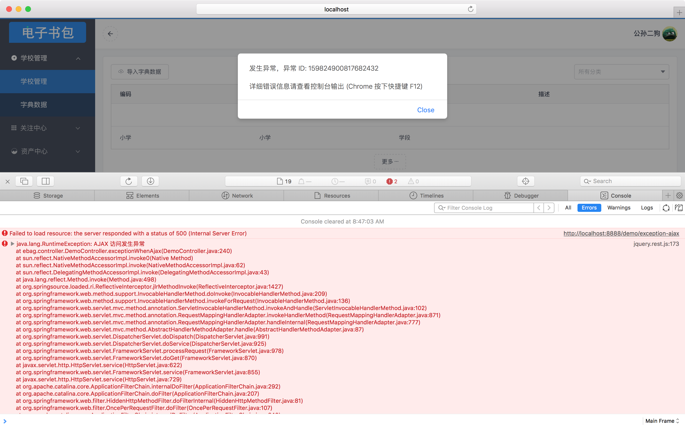

## 后端

所有未捕捉异常都被赋予一个唯一 ID 并自动写入日志文件，并分 2 中情况处理:

* 普通请求: 显示到错误页面

  如果抛出的异常是自定义异常 ApplicationException 的话，还可以为其指定专有的错误页面

* AJAX 请求: 异常信息被封装为 JSON 数据，HTTP 状态码为 500

## 前端

前端的数据请求统一使用 AJAX 的方式 (即使用请求头 `X-Requested-With: XMLHttpRequest`)，异常信息被封装在 JSON 数据中，HTTP 状态码为 500，我们提供的 AJAX 访问库 `jquery.rest.js` 已经对其进行了拦截，异常发生时都会被打印到控制台并且弹窗提示，用户提供异常 ID 就能很方便的从日志文件里找到错误信息，如图所示

