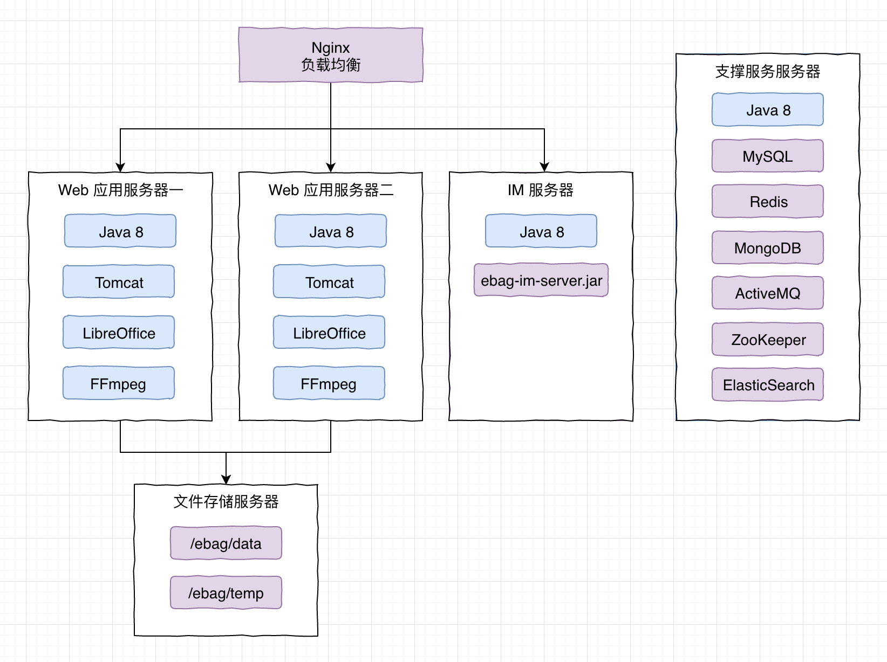
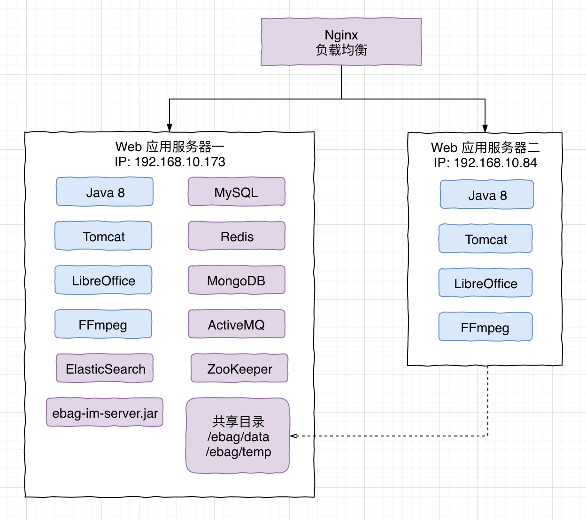

线上环境系统使用 CentOS 7 64 位系统，需要安装下列软件 (点开链接查看安装帮助)，并且在启动项目 (启动 Tomcat) 前需要服务支持软件都已经启动完毕。

## 部署架构



部署细节:

* Web 应用服务器采用集群

* Web 应用服务器一, Web 应用服务器二的`下面 2 个目录`需要映射到文件存储服务器上同名目录, 因为数据文件不能在每个服务器上各自存储, 而是应该集中存储:

  * `/ebag/data`
  * `/ebag/temp` 

  ```
  // 挂载命令参考
  // 提示: 为了可以 disable 文件和目录的缓存, 及时发现新增的文件, 需要参数 noac, 否则可能导致短时间的 404 错误
  mount -o nolock,noac -t nfs 192.168.10.173:/ebag/data /ebag/data
  mount -o nolock,noac -t nfs 192.168.10.173:/ebag/temp /ebag/temp
  ```

* 项目的 Web 应用部署到目录 `/www.ebag.com`, Tomcat 中增加 `${tomcat}/conf/Catalina/localhost/ROOT.xml` , 这样就可以使用 ROOT 项目启动了:

  ```xml
  <Context path="/" docBase="/www.ebag.com/ROOT"
      debug="0" privileged="true" reloadable="false">
  </Context>
  ```

* 消息服务 ebag-im-server.jar 也部署到目录 `/www.ebag.com`

* 上面部署分了 5 个服务器, 服务器不够时紫色的软件可以一起安装到一个服务器, 也可以根据软件的特点安装到不同配置的服务器上, 可参考下面的测试服务器简化部署

  

* 此外: 有条件的情况下 MySQL 使用主从, Redis 使用 Master-Slave, MongoDB 分片存储, ZooKeeper 使用 3 台进行集群

* Nginx:

  * 因为使用了集群, Nginx 上要进行负载转发请求到 Web 应用服务器上
  * IM 使用的是网站的域名 (学校的域名), 所以 Nginx 上要转发 IM 的 WebSocket 消息到对应的 IM 服务器上

## 用户管理

例如 ElasticSearch 不能使用 root 用户启动, 需要创建新的用户来启动它们.

* 查看有哪些用户: `cat /etc/passwd`
* 创建用户组 ebag 及用户 ebag: `groupadd ebag; useradd ebag -g ebag -p ebag`
* 修改目录和文件所属为组 ebag 和用户 ebag: `chown -R ebag:ebag ${dir}`
* 切换到 ebag 用户: `su ebag`

## 软件安装

解压的软件都解压安装到 `/usr/local/edu`, 使用 yum 安装的软件不修改安装位置:

* zip unzip: `yum install zip unzip -y`

* [Java 8](http://qtdebug.com/mac-centos7/)

* [Tomcat 8](http://qtdebug.com/mac-centos7/)

  * 创建软连接: `/usr/local/edu/tomcat` 指向 `/usr/local/edu/apache-tomcat-8.5.32`

  * 创建目录 `/www.ebag.com`，项目的代码部署到这里

  * 创建文件 `${tomcat}/conf/Catalina/localhost/ROOT.xml`，内容为

    ```
    <Context path="/" docBase="/www.ebag.com/ROOT"
        debug="0" privileged="true" reloadable="false">
    </Context>
    ```

  * 启动: `sh start.sh` or `sh catalina.sh run`

  * 关闭: `sh shutdown.sh`

  * Get 请求支持 UTF-8，修改 server.xml

    ```
    <Connector port="8080" protocol="HTTP/1.1"
               connectionTimeout="20000"
               redirectPort="8443"
               URIEncoding="UTF-8"/>
    ```

  * UTF-8 启动 Tomcat: 在 `catalina.sh` 中加一个 `-Dfile.encoding=UTF-8`

    ```
    JAVA_OPTS="$JAVA_OPTS -Dfile.encoding=UTF-8"
    ```

* [MySQL 5.7](https://my.oschina.net/Laily/blog/713023)

  * 编码: [使用 utf8mb4](https://blog.csdn.net/Guzarish/article/details/77530903)
  * 启动: `systemctl start mysqld.service`

* [Nodejs 8](http://qtdebug.com/mac-centos7/)

* [MongoDB 4.0.+](http://qtdebug.com/mac-centos7/)

  * 安全: 
    * 数据库 admin: 增加用户 admin, 密码 ebag, 权限 userAdminAnyDatabase
    * 数据库 ebag: 增加用户 ebag, 密码 ebag, 权限 dbAdmin 和 readWrite
    * 参考 
      * <https://qtdebug.com/mongo-auth/>
      * <https://docs.mongodb.com/manual/tutorial/enable-authentication/>
  * 启动: `systemctl start mongod`
  * 关闭: `systemctl stop mongod`

* [Redis 4](https://www.linode.com/docs/databases/redis/install-and-configure-redis-on-centos-7/)

  * 修改 `/etc/redis.conf` 中 bind 为  `bind 0.0.0.0`, 允许其他机器访问
  * 启动: `systemctl start redis`
  * 关闭: `systemctl stop redis`

* [LibreOffice 6](https://qtdebug.com/mac-centos7-libreoffice/)

  * 创建软连接 `/opt/libreoffice` 指向 LibreOffice6 的安装目录例如 `/opt/libreoffice6.1`

  * 需要安装中文字体，防止 PDF 转换出来是乱码

    ```
    cd /usr/share/fonts
    wget https://mirrors.tuna.tsinghua.edu.cn/adobe-fonts/source-han-sans/SubsetOTF/SourceHanSansCN.zip
    wget https://mirrors.tuna.tsinghua.edu.cn/adobe-fonts/source-han-serif/SubsetOTF/SourceHanSerifCN.zip
    unzip SourceHanSansCN.zip
    unzip SourceHanSerifCN.zip
    rm -rf SourceHanSerifCN.zip
    rm -rf SourceHanSerifCN.zip
    
    fc-cache -fv
    ```

  * 常用命令

    ```
    # --outdir . 为转换后输出的目录
    # x.docx 为要进行转换的文件
    转换命令: libreoffice6.1 --headless --convert-to pdf --outdir . x.docx
    
    # 上传下载文件使用 scp
    上传命令: scp x.docx root@vm.com:/root
    下载命令: scp root@vm.com:/root/x.pdf .
    ```

* [FFmpeg](http://ffmpeg.org)

  * 可以使用 yum 安装

* [ActiveMQ](http://activemq.apache.org/download.html)

  * 下载 5.15.6 Release 版本
  * 解压

* [ZooKeeper 3.4.13](https://mirrors.tuna.tsinghua.edu.cn/apache/zookeeper/zookeeper-3.4.13/)

  * 下载 3.4.13 版本

  * 解压 ZooKeeper

  * 创建 `/ebag/zookeeper/data` 和 `/ebag/zookeeper/log` 目录

  * 配置 conf/zoo.cfg

    ```
    tickTime=2000
    initLimit=10
    syncLimit=5
    dataDir=/ebag/zookeeper/data
    dataLogDir=/ebag/zookeeper/log
    clientPort=2181
    ```

* ElasticSearch

  * 下载: 目前 spring-data 最高支持版本为 elasticsearch-6.2.2，所以下载 https://artifacts.elastic.co/downloads/elasticsearch/elasticsearch-6.2.2.zip，解压即可

  * 修改配置文件 `config/elasticsearch.yml`:

    ```yaml
    cluster.name: ebag      # 集群名称
    node.name: node-1       # 节点名称
    network.host: 0.0.0.0   # 访问地址, 局域网需要访问
    http.port: 9200         # 端口
    ```

    启动失败请参考 <https://www.jianshu.com/p/312dfaa3a27b>

  * 为了支持中文分词，需要安装中文分词器，例如：ik，在 Elasticsearch 目录下执行:

    ```
    ./bin/elasticsearch-plugin install https://github.com/medcl/elasticsearch-analysis-ik/releases/download/v6.2.2/elasticsearch-analysis-ik-6.2.2.zip
    ```

    如果下载失败，可以使用下载工具先下载得到 elasticsearch-analysis-ik-6.2.2.zip，解压得到目录 `elasticsearch`，把这个目录重命名为 `ik`，复制目录 ik 到目录 `${elasticsearch}/plugins`，重启 Elasticsearch 即可生效。

* ImServer (电子书包自己的)

  * 复制 `ebag-im-server.jar` 到目录 `/www.ebag.com`

## 启动服务

在 Tomcat 运行前，需要以下几个软件都启动了:

* redis-server: `systemctl start redis`
* mysqld: `systemctl start mysqld.service`

* mongod: `/usr/bin/mongod --auth /etc/mongod.conf &`

  如果启动失败, 很可能是权限的问题, 修改 MongoDB 的相关数据库和日志的用户为 `mongod:mongod` (具体路径请查看 /etc/mongod.cfg 的配置):

  ```
  chown -R mongod:mongod /var/lib/mongo
  chown -R mongod:mongod /var/log/mongodb
  ```

* ElasticSearch:

  1. 进入目录:  `cd /usr/local/edu/elasticsearch-5.5.1`
  2. 切换用户:  `su ebag`, 不能使用 root 用户启动
  3. 启动服务:  `bin/elasticsearch -d`
  4. 测试服务:  `curl localhost:9200`
  5. 启动失败请参考 <https://www.jianshu.com/p/312dfaa3a27b>

* ImServer: 

  1. 进入目录:  `cd /www.ebag.com`
  2. 启动服务:  `nohup java -jar -Dfile.encoding=UTF-8 ebag-im-server.jar /ebag/logs/im-server.log 2>&1 &`

* ActiveMq:

  1. 进入目录:  `cd /usr/local/edu/apache-activemq-5.15.6`
  2. 启动服务:  `activemq start`

* ZooKeeper: `${zookeeper}/bin/zkServer.sh start`

* Tomcat:

  1. 进入目录:  `cd /usr/local/edu/apache-tomcat-8.5.32`
  2. 启动服务:  `bin/startup.sh`

可以使用下面的命令查看是否启动了:

```
ps aux | grep mysqld | grep -v grep
ps aux | grep mongod | grep -v grep
ps aux | grep redis-server | grep -v grep
ps aux | grep elasticsearch | grep -v grep
ps aux | grep ebag-im-server | grep -v grep
ps aux | grep activemq | grep -v grep
ps aux | grep zookeeper | grep -v grep
```

## 端口开放

外网开放端口:

* ImServer 端口: 3721

* ActiveMQ 端口: 8161

  使用 Web 工具查看 ActiveMQ 的状态时需要访问 8161 端口, 推荐开放

内网开放端口:

* MySQL 端口: 3306
* ActiveMQ 端口: 61616
* Redis 端口: 6379
* MongoDB 端口: 27017
* ElasticSearch 端口: 9200, 9300
* ZooKeeper 端口: 2181