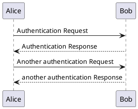

Docsify 支持 PlantUML 有 2 种方式:

* 内嵌
* 引用

详情请参考 [docsify-plantuml](https://github.com/imyelo/docsify-plantuml)。

## 内嵌

语法:

````js

````

效果:


## 引用

把 PlantUML 的文件内容保存为 Markdown 文件如 **plantuml-demo.md**，内容如下:

````js

````

语法:

```
[PlantUML Demo](resources/plantuml-demo.md ':include')
```

效果:

[PlantUML Demo](resources/plantuml-demo.md ':include')