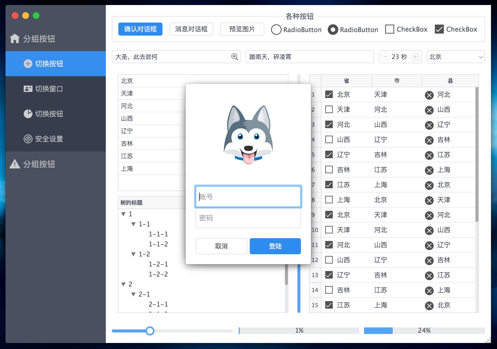
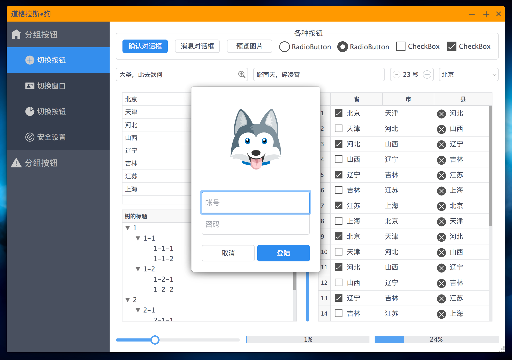

文件夹 gui 下面几个类是必要的，其他类例如 SettingWidget、WidgetsShower 等都是为了演示使用的，可以删除:

* TopWindow: 自定义无边框阴影窗口
* MessageBox: 基于 TopWindow 的消息对话框
* CentralWidget: 用于界面功能布局的模板，左侧边栏是菜单，右边显示不同功能相关的 widget

编译后把`源码 bin 目录下的所有文件`复制到编译出来的可执行文件所在目录，然后运行，界面效果有 2 种:





> 请注意查看代码中标记为 `CentralWidget 中 TODO` 的地方

## 侧边栏按钮

有 2 种按钮(为了更好的 QSS 效果，代码中会把 QPushButton 的 flat 属性设置为 true):

* 分组按钮: class 为 `GroupButton`
* 组内按钮: class 为 `GroupItemButton`

每个按钮都有以下属性:

* `class`: GroupButton or GroupItemButton

* `groupName`: 同一组的按钮的 groupName 都一样，为了同时显示和隐藏他们(只有 class 为 GroupItemButton 的按钮需要隐藏和显示)

* `action`: popup or empty or 不存在

  * 为 popup 指点击后弹出对话框，其他操作也可以

  * 为空或者不存在这个属性，点击后对应 widget 切换显示到中间区域的 `contentStackedWidget`

    > 这些按钮会被自动的添加到一个 QButtonGroup，为了保证同时只有一个被选中


在 Ui Designer 中打开 `gui/CentralWidget.ui` 编辑侧边栏按钮，增加按钮的时候务必按照上面的规则给按钮增加相遇的属性。

## 功能相关的 widget

功能相关的 widget 显示在窗口右边的主要内容区 `contentStackedWidget` 中:

```cpp
/**
 * 创建需要在内容区 stacked widget 中显示的 widget
 * @param button 侧边栏切换界面的按钮
 */
void CentralWidget::createWidgetInContentStackedWidget(QAbstractButton *button) {
    // TODO: 创建 widget，需要根据实际的 widget 类来创建
    if (button == ui->itemButton1) {
        // [1] 创建 widget
        QWidget *w = new WidgetsShower();
        d->buttonWidgetHash.insert(ui->itemButton1, w);

        // [2] 添加 widget 到窗口中
        UiUtil::addWidgetIntoStackedWidget(w, ui->contentStackedWidget);
    } else if (button == ui->itemButton2) {
        QWidget *w = new MeasurementWidget();
        d->buttonWidgetHash.insert(ui->itemButton2, w);

        UiUtil::addWidgetIntoStackedWidget(w, ui->contentStackedWidget);
    }
}
```

> 使用 QStackedWidget 动态的切换 widget，点击左边的侧边栏中的按钮后，在 contentStackedWidget 里面显示对应的 widget。

## 自定义无边框窗口

TopWindow 为自定义无边框窗口，可以创建普通窗口，也可以创建模态窗口，参考下面的使用

```cpp
// 主要组件的 Widget
CentralWidget *centralWidget = new CentralWidget();

// [1] 使用自定义窗口显示主窗口: 普通窗口，显示最大最小和关闭按钮，可调整窗口大小
TopWindow window(centralWidget);
window.setTitle("普通窗口"); // 默认使用 centralWidget 的 windowTitle
window.resize(1000, 700);
window.show();

// [2] 点击按钮弹出阻塞模态对话框，在任务栏不显示图标
connect(ui->modalDialogButton, &QPushButton::clicked, [] {
    DemoWidget *c = new DemoWidget();
    TopWindow window(c);
    window.showModal();

    // 直到关闭 window，程序才继续往下运行
    qDebug() << c->getStatus();
});
```

## 消息对话框

MessageBox 是使用 TopWindow 实现的消息对话框，参考下面的使用

```cpp
// 可显示普通字符串和 HTML
MessageBox::message("花果山再来一瓶科技信息技术有限公司\n法人是齐天大圣");
MessageBox::message("<b>公司</b>: 花果山再来一瓶科技信息技术有限公司<br>"
                   "<b>法人</b>: 齐天大圣<br>"
                   "<b>版本</b>: Release 1.1.3<br>"
                   "<center></center>", 350, 140);
```

## 确认对话框

```cpp
if (MessageBox::confirm("确定删除吗？")) {
    qDebug() << "删除";
}
```

## 登陆对话框

显示登陆对话框只需要调用下面的代码:

```cpp
// 显示登陆对话框，点击取消按钮登陆失败退出程序，登陆成功继续往下运行
// 输入错误信息虽然登陆不成功，但是不会退出程序，而是提示输入错误，继续输入登陆
if (!LoginWidget::login()) {
    exit(0);
}
```

## 修改 QSS 样式

QSS 文件位于可执行文件同目录的 `resources/qss` 文件夹下，例如修改侧边栏的按钮的图标，修改 sidebar.qss 中对应按钮的图片即可(使用 objectName 进行选择)。

QSS 文件修改后，按下 `Ctrl + L` 即可自动加载就能看到效果，不需要重启程序。

可以增加新的 QSS 文件，文件名添加到 `config.json` 中的 `qss_files` 数组中即可。

## 日志工具

增加了日志框架，`qDebug()` 输出的内容会自动记录到 exe 所在目录的 log 目录下，每天生成一个日志文件。

## 在 QLineEdit 右边创建按钮

为了在 QLineEdit 右边创建按钮，调用 `UiUtil::createLineEditRightButton(lineEdit)` 函数:

```cpp
QPushButton *previewButton = UiUtil::createLineEditRightButton(ui->bookCoverEdit); // 创建封面预览按钮
previewButton->setObjectName("previewButton");
```

然后可以使用 QSS 设置它的图标 (在 qss/widget.qss 中已经设置好它的大小等样式了):

```css
#previewButton {
    border-image: url(img/common/preview.png) 0;
}

#previewButton:hover {
    border-image: url(img/common/preview-hover.png) 0;
}

#previewButton:pressed {
    border-image: url(img/common/preview-pressed.png) 0;
}
```

## 下载预览图片

Qt 没有显示网络图片的 widget，为此提供了函数 `UiUtil::previewImage(url)` 显示网络图片，图片会被缓存到指定的目录。

## 自定义字体

除了使用系统自带的字体，还能够从网上下载字体，然后使用:

1. 网上下载字体文件，放到 font 目录

2. 加载字体: 修改配置文件 `config.json` 的 `font_files`，程序启动时会调用 `QFontDatabase::addApplicationFont(file)` 加载字体到程序中

3. 修改 QSS 设置字体: 在 `resources/qss` 目录下的 QSS 文件中设置 Widget 的字体，例如

   ```css
   QWidget {
       font-family: "云书法手书罗西硬笔行楷";
   }
   
   #myWidget {
       font-family: Monaco;
   }
   ```


需要注意，OSX 系统不支持 `QFontDatabase::addApplicationFont(file)` 加载字体了 (10.9 的时候还支持)，需要先安装字体，然后在 QSS 中使用。

