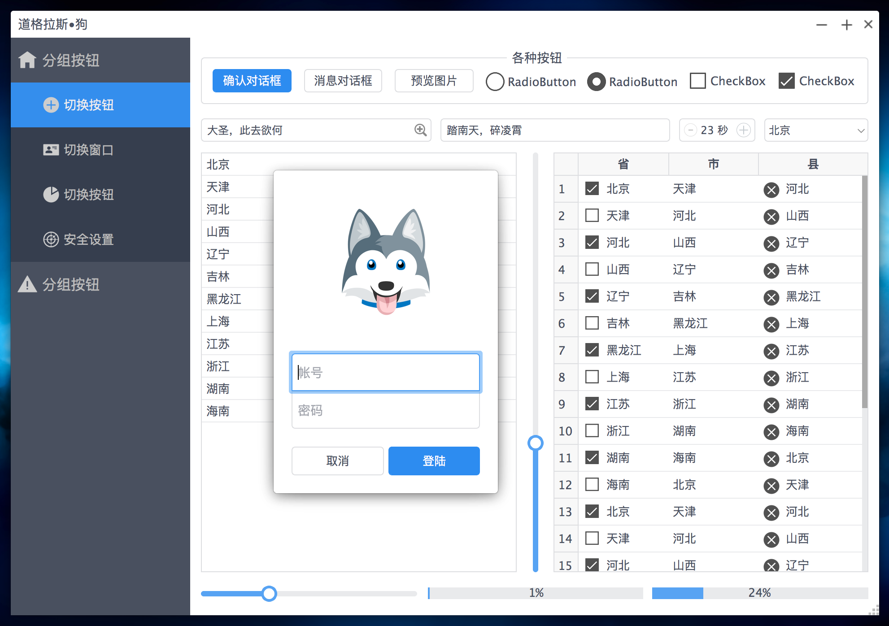

界面效果为



## 侧边栏按钮

有 2 种按钮(都要设置 flat 为 true):

* 分组按钮: class 为 GroupButton
* 组内按钮: class 为 GroupItemButton

每个按钮都有以下属性:

* `class`: GroupButton or GroupItemButton

* `action`: popup or empty

  * popup 指点击后弹出对话框

  * 空的时候可以不增加这个属性

  * 空则点击后对应 widget 显示到中间区域的 Content Stacked Widget

    > 这些按钮会被自动的添加到一个 QButtonGroup，为了保证同时只有一个被选中

* `groupName`: 同一组的按钮的 groupName 都一样，为了同时显示和隐藏他们(只有 class 为 GroupItemButton 的按钮需要隐藏和显示)

在 gui/CentralWidget.ui 中编辑侧边栏按钮

## 主要内容区: ContentStackedWidget

使用 QStackedWidget 动态的显示 widget，这样点击左边的侧边栏中的按钮后，在它里面显示对应的 widget

## 日志

增加了日志框架，`qDebug()` 输出的内容会自动记录到 exe 所在目录的 log 目录下。

## 自定义无边框窗口

MagicWindow 为自定义无边框窗口，可以创建普通窗口，也可以创建模态窗口，参考下面的使用

```cpp
// 主窗口
CentralWidget *centralWidget = new CentralWidget();

// [1] 使用自定义窗口显示上面的主窗口: 普通窗口，显示最大最小和关闭按钮，可调整窗口大小
MagicWindow window(centralWidget);
window.setTitle("普通窗口");
window.resize(1000, 700);
window.setResizable(false);
window.show();

// [2] 点击按钮弹出模态对话框，在任务栏不显示图标
QObject::connect(button, &QPushButton::clicked, [=] {
    QWidget *centralWidget2 = new QWidget();
    centralWidget2->setStyleSheet("background: #AAA;");

    // showModal() 显示为模态对话框，并且使用了自定义边框图片
    MagicWindow *dialog = new MagicWindow(centralWidget2, QMargins(4,4,4,4), QMargins(8,8,8,8), ":/img/colorful-border.png", true);
    dialog->setTitle("模态对话框");
    dialog->setResizable(false);
    dialog->setAttribute(Qt::WA_DeleteOnClose);
    dialog->showModal();
});
```

