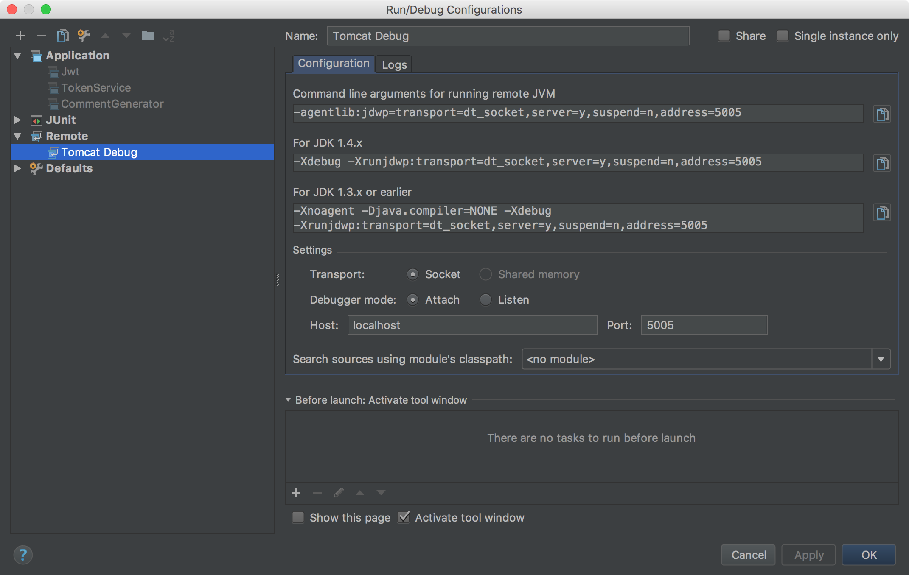

## 准备

1. Windows 命令行 CMD 显示 UTF-8 字符

   执行 `chcp 65001`，设置命令行的属性，选择字体 `Lucida Console`。如果要换回 GBK 执行 `chcp 936` ，再把字体改成**点阵字体**即可

   > 提示: 
   >
   > * CMD 显示 UTF-8 后界面刷新不够干净，推进使用更好用的免费命令行工具 [ConEnu](https://github.com/Maximus5/ConEmu)，当然为了显示 UTF-8 也需要在它里面自行一次 `chcp 65001`
   > * 在 **ConEnu** 中可以直接 ctrl+c, ctrl+v 进行复制粘贴
   > * 在 ConEnu 中可以使用标签页等很多其他特性

2. 安装 Redis 和 MySQL

   * MySQL 的编码设置为 UTF-8

3. 安装 Gradle

   * 修改 Gradle 的编码为 UTF-8，可参考 <http://qtdebug.com/spring-web-introduction/>

   * [修改 Gradle 的 Maven 仓库](http://qtdebug.com/gradle-maven-repo/)，默认的太慢了，修改 `<USER_HOME>/.gradle/init.gradle` 的内容如下

     ```groovy
     allprojects {
         repositories {
             def REPOSITORY_URL = 'http://maven.aliyun.com/nexus/content/groups/public/'
             all { ArtifactRepository repo ->
                 if(repo instanceof MavenArtifactRepository) {
                     def url = repo.url.toString()
                     if (url.startsWith('https://repo1.maven.org/maven2') || url.startsWith('https://jcenter.bintray.com/')) {
                         project.logger.lifecycle "Repository ${repo.url} replaced by $REPOSITORY_URL."
                         remove repo
                     }
                 }
             }
             maven {
                 url REPOSITORY_URL
             }
         }
     }
     ```

4.  复制项目模版 `template-web-gradle` 到目标文件夹下，重命名，例如为 `fox`

5.  集成开发环境推荐使用 IDEA，并在 IDEA 中安装 Lombok 插件

   > 为了方便的从 MyBatis 的 Mapper java 文件跳转到 Mapper xml 文件，推荐安装插件 `MyBatis mini-plugin`

6. 在 IDEA 中导入上面的 Gradle 项目: 

    1.  IDEA 的菜单 View > Tool Windows > Gradle
    2.  点击 `+`，选择项目的 build.gradle 进行导入

7. 项目的 context path

   * 如果项目的 `contextPath` 想用 `/`，则为空即可

   * 如果项目的 `contextPath` 不是 `/`，例如为 `fox`，需要修改 `contextPath` 如:

     ```groovy
     gretty {
         httpPort = 8080
         contextPath = '/fox'
         servletContainer = 'tomcat8'

         inplaceMode  = 'hard'
         debugSuspend = false
         managedClassReload      = true
         recompileOnSourceChange = true

         // 升级 gretty 自带的 springloaded
         jvmArgs = ["-javaagent:${project.projectDir}/springloaded-1.2.8.RELEASE.jar", '-noverify']
     }
     ```

8. 修改包名，当前包名使用了 `com.xtuer`，根据项目需要进行修改，例如修改为 `edu`，请参考 `使用说明.md` 中的 `修改包名` 部分

## 运行

1. 运行 Redis 和 MySQL: 它们的配置在 **config.groovy** 里

2. 运行项目: `gradle clean appStart`

## 调试

1. Debug 模式运行项目: `gradle clean appStartDebug`

2. IDE 里使用远程 Debug

   

   > 具体可参考: 
   >
   > * [IntelliJ IDEA 远程调试 Tomcat](https://github.com/judasn/IntelliJ-IDEA-Tutorial/blob/master/remote-debugging.md)
   > * [Attach Intellij-IDEA debugger to a running java process](https://stackoverflow.com/questions/21114066/attach-intellij-idea-debugger-to-a-running-java-process)


---

Eclipse: workspace > project


IDEA: project > module