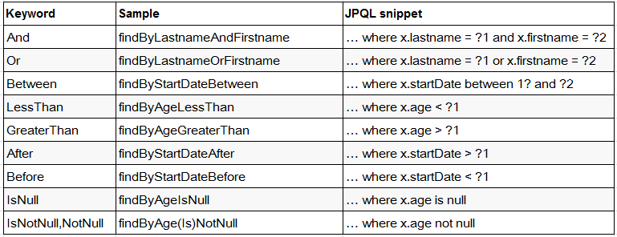
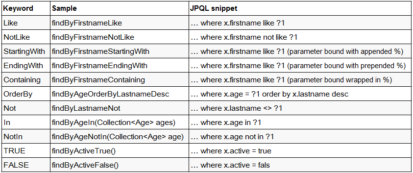

Mapper 中方法的命名可参考 JPA 属性查询的命名规范，大致如下：

| Key Word    | SQL                              | Method                                                |
| ----------- | -------------------------------- | ----------------------------------------------------- |
| And         | 等价于 SQL 中的 `AND` 关键字     | `findByUsernameAndPassword(String user, Striang pwd)` |
| Or          | 等价于 SQL 中的 `OR` 关键字      | `findByUsernameOrAddress(String user, String addr)`   |
| Between     | 等价于 SQL 中的 `BETWEEN` 关键字 | `findBySalaryBetween(int max, int min)`               |
| LessThan    | 等价于 SQL 中的 `<`              | `findBySalaryLessThan(int max)`                       |
| GreaterThan | 等价于 SQL 中的 `>`              | `findBySalaryGreaterThan(int min)`                    |
| IsNull      | 等价于 SQL 中的 `IS NULL`        | `findByUsernameIsNull()`                              |
| IsNotNull   | 等价于 SQL 中的 `IS NOT NULL`    | `findByUsernameIsNotNull()`                           |
| NotNull     | 与 `IsNotNull` 等价              |                                                       |
| Like        | 等价于 SQL 中的 `LIKE`           | `findByUsernameLike(String user)`                     |
| NotLike     | 等价于 SQL 中的 `NOT LIKE`       | `findByUsernameNotLike(String user)`                  |
| OrderBy     | 等价于 SQL 中的 `ORDER BY`       | `findByUsernameOrderBySalaryAsc(String user)`         |
| Not         | 等价于 SQL 中的 `!=`             | `findByUsernameNot(String user)`                      |
| In          | 等价于 SQL 中的 `IN`             | `findByUsernameIn(Collection<String> userList)`       |
| NotIn       | 等价于 SQL 中的 `NOT IN`         | `findByUsernameNotIn(Collection<String> userList)`    |

