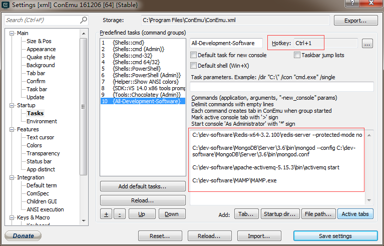
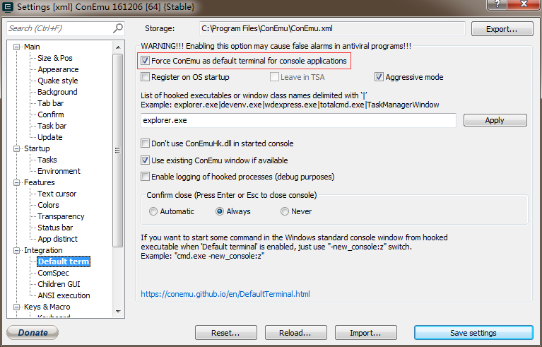

下面只介绍 Windows 中相关软件的下载启动。

开发时需要很可能需要依赖于其它软件的服务，如 Redis、 MongoDB、ActiveMQ、MySQL 等，可以一个一个的启动它们，也可以使用 bat 脚本批量启动，但使用 bat 脚本启动的最大问题是每个程序都会打开一个窗口，会感觉好乱。

为了体验更好，我们将使用 ConEmu 代替 CMD，在它里面使用快捷键和标签页来打开软件。

## ConEmu

访问 <https://github.com/Maximus5/ConEmu> 下载安装，然后在其设置的 `Startup -> Task` 中增加一个新的任务，任务的命令如下启动我们所有需要的软件，并给其设置快捷键为 `Ctrl + 1`，这样在 ConEnu 中按下 `Ctrl + 1` 后就会执行这个任务，把我们所需要的软件一次打开:

```shell
C:\dev-software\Redis-x64-3.2.100\redis-server --protected-mode no
C:\dev-software\MongoDB\Server\3.6\bin\mongod --config C:\dev-software\MongoDB\Server\3.6\bin\mongod.conf
C:\dev-software\apache-activemq-5.15.3\bin\activemq start
C:\dev-software\MAMP\MAMP.exe
```

## 配置截图

快捷键启动软件，红框中为快捷键和启动软件的命令:



启动多个软件的效果:


设置 ConEmu 替代 CMD，这样打开 CMD 的时候就自动打开 ConEmu:

