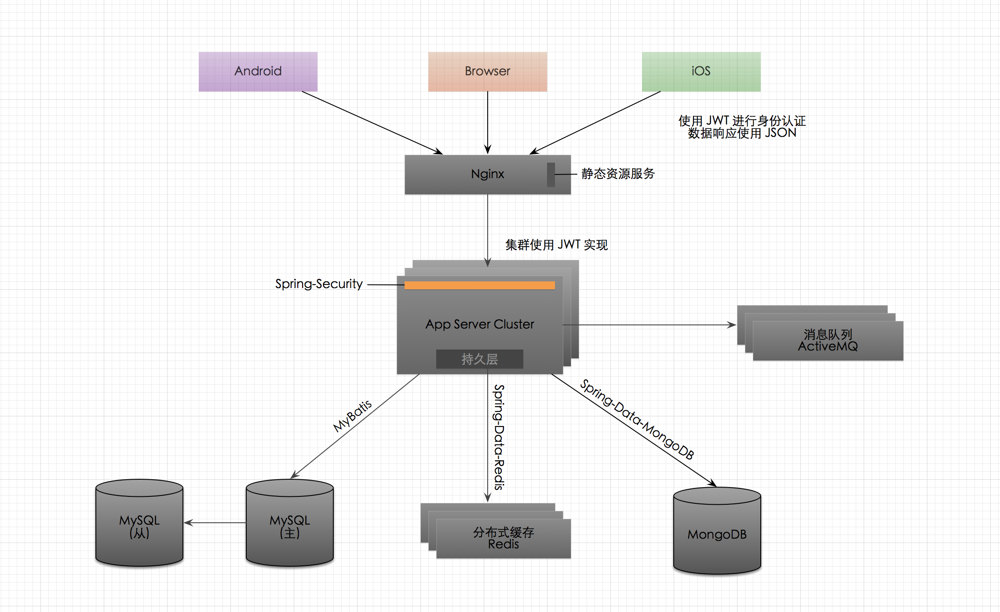

项目的架构非常简单:

* 目前只使用了集群，没有使用微服务，当增加硬件能解决问题的时候就尽量不要用微服务
* Nginx 作为负载均衡，同时可以作为静态文件服务器
* 集群和身份验证使用 JWT，避免了使用 Session 集群的缺点，又能方便移动端访问
* 消息队列进行削峰为服务器减压，给移动端推送消息
* MySQL 存储业务数据
* MongoDB 存储后期需要大数据分析的数据，如作为 LRS，因为不能关系查询，所以很多数据项都会有冗余

